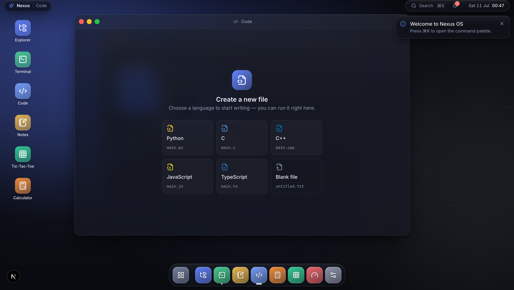

<div align="center">

# Nexus OS

**A desktop operating system that runs entirely in your browser.**

No backend · no accounts · no API keys. Clone, install, and the whole desktop boots on `localhost`.

[](https://github.com/ashutoshsharma1309/nexusos/actions/workflows/ci.yml)
[](https://nextjs.org)
[](https://react.dev)
[](https://www.typescriptlang.org)
[](LICENSE)



</div>

---

## What it is

Nexus OS is a composited, window-managed desktop environment implemented as a single-page
React application. It is built to answer one question convincingly: _how much of a real operating
system's shell can you rebuild in the browser with modern frontend engineering?_

Everything is local. State lives in memory ([Zustand](https://github.com/pmndrs/zustand)) or in the
browser's IndexedDB ([Dexie](https://dexie.org)). There is no server to run, nothing to authenticate,
and no network round-trips — the app works fully offline the moment it loads.

## Highlights

| Subsystem | What makes it interesting |
| --- | --- |
| **Window manager** | Pointer-driven drag & 8-way resize, edge snap-tiling, focus/z-index ordering in a single deterministic pass, spring physics, and a genie-style minimize-into-dock animation. |
| **Dock** | Cursor-proximity magnification driven by Framer Motion `MotionValue`s (off the React render loop), launch bounce, focus-aware running pills, and per-app notification badges. |
| **Code editor** | A self-contained editor that **actually runs code locally** — real JS/TS execution plus hand-written interpreters for Python, C and C++ — with a VS Code-style integrated output panel. |
| **Terminal** | A Warp-inspired shell over the virtual filesystem: command _blocks_, ghost autocomplete, syntax tones, and a faux toolchain (`git`, `npm`, `docker`, `neofetch`, `htop`, …). |
| **Command palette** | Fuzzy search ([Fuse.js](https://fusejs.io)) across apps, themes and system actions, fully keyboard-navigable (`⌘K`). |
| **Theme engine** | Eight hand-tuned themes + accent override, driven entirely by CSS custom properties so a theme switch is a single DOM write. |

Bundled apps: **Explorer · Terminal · Code · Notes · Calculator · Tic-Tac-Toe · System Monitor · Settings**.

## Running code, for real

The Code app doesn't fake execution. Because there is no backend, the runtime is implemented
in the browser:

- **JavaScript / TypeScript** run for real in a sandboxed function with a captured `console`.
- **Python, C and C++** run through purpose-built interpreters ([`src/features/editor/runtime`](src/features/editor/runtime))
  sharing one expression evaluator. They cover the teaching subset — variables, arithmetic,
  strings, `printf`/`cout`/`print`, loops, conditionals and functions — with real error reporting
  and an infinite-loop guard.

```c
#include <stdio.h>
int main(void) {
    for (int i = 1; i <= 3; i++) printf("row %d\n", i);
    return 0;
}
```

Open **Code → C → Run** and the output panel prints `row 1 / row 2 / row 3` with an exit code and timing.

## Quick start

```bash
pnpm install
pnpm dev          # → http://localhost:3000
```

Requires Node ≥ 20 and [pnpm](https://pnpm.io). No environment variables, no services.

## Keyboard shortcuts

| Shortcut | Action |
| --- | --- |
| `⌘K` / `Ctrl K` | Command palette |
| `⌘W` / `Ctrl W` | Close focused window |
| `⌘M` / `Ctrl M` | Minimize focused window |
| `Ctrl` + `` ` `` | Cycle window focus (`⇧` reverses) |
| `⌘↵` / `Ctrl ↵` | Run the current file (Code app) |
| Double-click title bar | Maximize / restore |
| Drag window to a screen edge | Snap-tile |

## Architecture

Nexus OS uses a **feature-sliced** architecture: each feature under `src/features/*` owns its
components, hooks, store and types, and exposes a small public surface. The app registry
code-splits every application with `next/dynamic`, so an app's bundle only ships when it is first opened.

```
src/
├── app/           Next.js App Router entry (layout, providers)
├── components/ui/ Cross-feature primitives (Button, ContextMenu, …)
├── features/      Self-contained slices (window-manager, dock, editor, terminal, …)
├── providers/     ThemeProvider, BootProvider
├── hooks/         Cross-cutting hooks (global shortcuts, pointer ambient)
├── lib/           Pure utilities (motion tokens, geometry, cn)
├── services/      Dexie database + virtual filesystem
└── styles/        Global CSS + the 8-theme token engine
```

See [`docs/Architecture.md`](docs/Architecture.md) for diagrams and the state model,
and [`docs/FutureRoadmap.md`](docs/FutureRoadmap.md) for what's planned next.

## Tech stack

Next.js 15 (App Router) · React 19 · TypeScript (strict, `noUncheckedIndexedAccess`) ·
Tailwind CSS · Zustand · Framer Motion · Dexie / IndexedDB · Fuse.js · Lucide · Vitest.

## Scripts

```bash
pnpm dev          # start the dev server
pnpm build        # production build
pnpm start        # serve the production build
pnpm typecheck    # tsc --noEmit (strict)
pnpm lint         # eslint
pnpm test         # vitest (unit tests for the runtime, window manager, games)
pnpm format       # prettier
```

## Testing

The interpreters, window-manager reducer, minimax AI, calculator engine and geometry helpers are
covered by [Vitest](https://vitest.dev) unit tests — the parts where correctness actually matters.

```bash
pnpm test          # run once
pnpm test --watch  # watch mode
```

## License

[MIT](LICENSE) © Ashutosh Sharma
