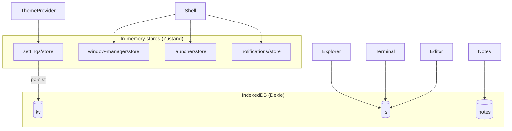
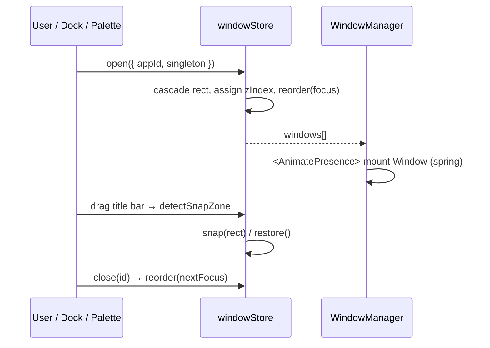

# Architecture

Nexus OS is a **feature-sliced** single-page desktop shell. There is no server; all
state lives in memory (Zustand) or IndexedDB (Dexie). The design goal is that every
subsystem is independently reasoned-about and swappable.

## Folder structure

```
src/
├── app/                 # Next.js App Router entry (layout, page, providers)
├── components/ui/       # Cross-feature primitives (ContextMenu, …)
├── features/            # Self-contained feature slices — each owns its
│   ├── window-manager/  #   components, hooks, store, types
│   ├── dock/
│   ├── desktop/
│   ├── launcher/        # command palette
│   ├── notifications/
│   ├── settings/
│   ├── apps/            # app registry (code-split definitions)
│   ├── explorer/ terminal/ notes/ editor/ monitor/ about/
├── providers/           # ThemeProvider, BootProvider
├── hooks/               # cross-cutting hooks (global shortcuts)
├── lib/                 # pure utilities (cn, geometry)
├── services/            # db (Dexie), filesystem
└── styles/              # globals + theme tokens
```

Every file is kept small and composable; feature slices never import another
feature's internals except through its public store/registry.

## State model



- **Window manager** is the heart. `open/close/focus/minimize/maximize/snap`
  operate on a `WindowInstance[]`. A single `reorder()` pass reassigns contiguous
  z-indices and the `focused` flag, keeping ordering deterministic.
- **Settings** persist to the `kv` table; `ThemeProvider` reflects them onto
  `<html>` as `data-*` attributes + CSS variables, so a theme change is one cheap
  DOM write rather than a React re-render cascade.
- **Apps** are registered in `features/apps/registry.tsx` and loaded with
  `next/dynamic`, so each app's JS only ships when first opened.

## Window lifecycle



## Rendering & performance

- App bundles are **code-split** per window via `next/dynamic` + React `Suspense`.
- Dock magnification uses Framer Motion `MotionValue`/`useSpring` — animation runs
  off the React render loop entirely.
- Windows are absolutely positioned and GPU-composited; drag/resize write geometry
  through pointer events, not layout thrash.
- `lucide-react` and `framer-motion` are tree-shaken via `optimizePackageImports`.

## Accessibility

`prefers-reduced-motion` is honored automatically and can be forced from Settings.
High-contrast and reduce-transparency modes toggle `data-*` attributes consumed by
global CSS. Interactive elements use semantic roles, ARIA labels and visible focus
rings.
